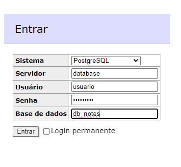

## Descrição
Este projeto foi elaborado com TypeOrm, PostgreSQL e um container de docker para hospedar o banco de dados, foram utilizadas migrations para segurar que nennhuma informação fetalhe ou dado seja perdido na hora de levar o mesmo para produção.

utilizei NestJs que é um framework de backend de estrutura modular o que facilta e simplifica o desenvolvimento.

## Instalação
clonar o repositório para a maquina local 
```bash
$ git clone https://github.com/eliezerlobaton/core-note-back.git
```
e instalar as dependências 
##caso não tenha pnpm instalado pode usar npm ou yarn 
```bash
$ pnpm install
```
## caso queira pode ativar pnpm com 
```bash
$ sudo corepack enable pnpm
```

## correndo a app

O primeiro a ser feito é levantar o container de docker
```bash
$ docker compose up -d
```
para acessar ao banco de dados usar http://localhost:8080  na página inicial teremos um formulário que vamos configurar da seguinte forma
sistema: PostgreSQL
servidor: colocar o nome do service que esta no arquivo compose.yml neste caso database
usuario, senha e base de dados: são os mesmos que configuramos no arquivo env


uma vez o conatiner esteja correndo de forma correta é hora de correr a migration para gerar a nossa tabela 
```bash
$ pnpm run migrate
```
Já feito isso podemos colocar o nosso servidor para correr

```bash
# development
$ pnpm run start

# watch mode
$ pnpm run start:dev

# production mode
$ pnpm run start:prod
```

